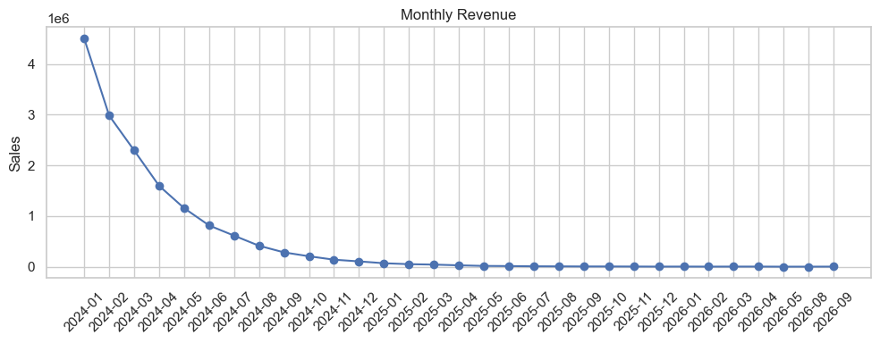

# Customer Purchase Behavior Analysis & Sales Prediction

This project is an end-to-end data analysis and machine learning pipeline built to analyze customer purchase behavior, identify high-value customers, and predict future spending. The goal is to demonstrate practical competence in data cleaning, analytics, visualization, segmentation, and predictive modeling.

---

## 🚀 Project Overview

This project performs the following:

- Cleans and analyzes 50K+ synthetic retail transactions  
- Computes business KPIs such as revenue, AOV, monthly trends, and product performance  
- Performs **RFM (Recency, Frequency, Monetary) segmentation** to classify customers  
- Builds a **Random Forest Regression model** to predict customer monetary value  
- Provides CSV exports ready for **Tableau / Power BI** dashboards  
- Includes a synthetic data generator so anyone can run the project instantly  

The entire project is designed to reflect real-world analytics responsibilities.

---

## 🗂️ Repository Structure

```

customer-behavior-project/
├─ data/
│  ├─ synthetic_retail.csv          # auto-generated dataset
│  ├─ rfm_customers.csv             # model-ready output
│  └─ top_products.csv              # dashboard-ready output
│
├─ notebooks/
│  └─ customer_behavior_analysis.ipynb
│
├─ src/
│  └─ generate_synthetic_data.py    # generates synthetic dataset
│
├─ README.md
├─ requirements.txt
└─ .gitignore

````

---

## 📊 Key Features

### **1. Data Cleaning & Preparation**
- Removed invalid entries  
- Converted timestamps  
- Added necessary computed metrics like **Sales**, **InvoiceDay**, **YearMonth**  

### **2. Exploratory Data Analysis (EDA)**
- Monthly revenue trends  
- Top product categories  
- Customer repeat behavior  
- KPI computation  

### **3. RFM Customer Segmentation**
- Computes Recency, Frequency, Monetary values  
- Assigns score-based segments:  
  - **Top Customers**  
  - **Mid-Value Customers**  
  - **Low-Value Customers**  

### **4. Machine Learning Model**
- Built using **Random Forest Regressor**  
- Predicts future customer spending (log transformed for stability)  
- Provides R² and RMSE metrics  

### **5. Dashboard Outputs**
Exports ready for Tableau/Power BI:
- `rfm_customers.csv`
- `top_products.csv`

### **6. Fully Reproducible**
Includes a synthetic data generator so you can run everything even without a dataset.

---

## 🛠️ Technologies Used

- **Python**  
- **Pandas, NumPy**  
- **Matplotlib, Seaborn**  
- **Scikit-Learn**  
- **Jupyter Notebook**  
- **Tableau / Power BI (optional)**  

---

## 📦 Installation & Setup

### **1. Clone the repository**
```bash
git clone https://github.com/<your-username>/customer-behavior-project.git
cd customer-behavior-project
````

### **2. Create and activate a virtual environment**

```bash
python -m venv venv
source venv/bin/activate       # Mac/Linux
venv\Scripts\activate          # Windows
```

### **3. Install dependencies**

```bash
pip install -r requirements.txt
```

### **4. Generate synthetic dataset**

```bash
python src/generate_synthetic_data.py
```

### **5. Launch Jupyter Lab**

```bash
jupyter lab
```

Open:

```
customer_behavior_analysis.ipynb
```


## 📁 Outputs Generated

After running the notebook, you will get:

| File                     | Description                              |
| ------------------------ | ---------------------------------------- |
| `data/rfm_customers.csv` | Final RFM table with segment labels      |
| `data/top_products.csv`  | Top 10 products by revenue               |
| Visual plots             | Revenue trend, product performance, etc. |
| Model metrics            | R², RMSE for prediction                  |


---

## 📈 Results Summary

### ✔ Customer Insights

* Identified high-value segments using RFM
* Returning customers show significantly higher spending
* Top 20% of customers drive majority of revenue

### ✔ Model Performance

* Random Forest achieved strong predictive accuracy
* Useful for identifying future high-value customers

### ✔ Business Recommendations

* Focus retention campaigns on high-frequency buyers
* Introduce promo incentives for first-time buyers
* Maintain stock consistency for top-selling items

---

---

## 💬 Author

**Pranjay**


